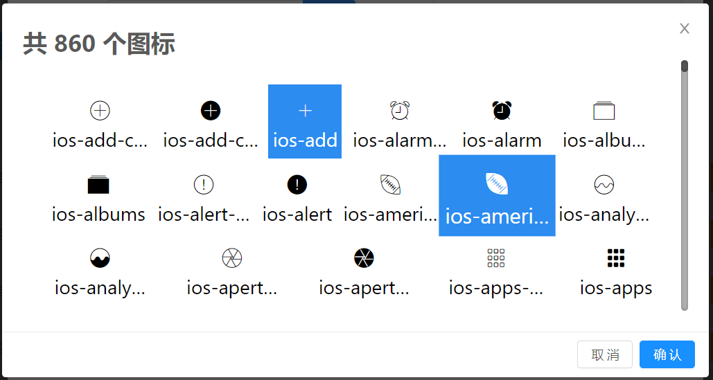
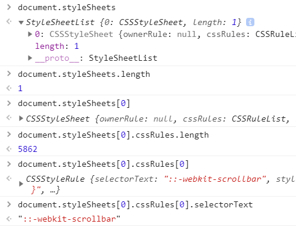

# A003_如何快速生成一个图标库界面 #

## &01.需求 ##

**需求** ： 实现一个图标库的选择界面，展示UI库中所有的图标并提供选择功能

- ICON库——iview UI 共 860 个



## &02.实现思路 ##

**思路** 从 `iview` CSS 样式表中 提取所有的 `.ivu-icon`的样式，并处理成数组 利用 v-for 实现循环渲染

>[基本知识参考-CSS操作](http://javascript.ruanyifeng.com/dom/css.html#toc1)

**CSSStyleDeclaration.parentRule属性返回当前规则所属的那个样式块（CSSRule 实例）。如果不存在所属的样式块，该属性返回null。**

```js{0}
var declaration = document.styleSheets[0].rules[0].style;
declaration.parentRule === document.styleSheets[0].rules[0]
```

## &03.代码块 ##

::: tip 注意

- **styleSheets**、**cssRules** 都是 `Object` 类型，其本身定义了一个 `length` 的键值;

- 除 `length` 外每个键值从0开始自增，所以在取值时以 styleSheets[0] 去取 ，并非数组的取值；

- 还有一点要注意的是：在开发环境下，css未被打包时肯能会有多个styleSheets存在、而生产环境下css会默认被统一打成一份即只存在一个styleSheets

:::


```js{0}
/**
* 提取ICON
*/
getIconsArr () {
  let data = [];
  let docSheets = document.styleSheets||[];
  for ( let sheets of  docSheets ) {
      if(sheets.cssRules.length!==0){
          for (let index in sheets.cssRules) {
              let reStr = sheets.cssRules[index].selectorText||sheets.cssRules[index].cssText;
              if(reStr!=undefined&&reStr.startsWith('.ivu-icon-')){
                data.push(reStr.split('::')[0].slice(10,reStr.split('::')[0].length)) ;
              }
          }
      }
  }
  // 数组去重
  let set = new Set(data);
  this.icons = new Array(...set);
}
```

**循环生成图标**

`<Icon :type="ico" size="large"></Icon>`  语法基于 `iview` UI库用法

```vue
<h1>共 {{icons.length||0}} 个图标</h1>
<section class="menu-icons-wrap">
    <div  v-for="(ico,index) in icons" :key="'ico_'+index"
        @click="$store.commit('iconClick',ico)"
        class="menu-icons-items" 
        :class="{'menu-icons-items-selected':curIcon==ico}">
        <Icon :type="ico" size="large"></Icon>
        <span>{{ico}}</span>
    </div>
</section>
```

图标的选择功能 基于 vuex 状态管理实现，选中状态由`curIcon`的值决定每个元素的`class`
```css
<style scoped>
  .menu-icons-wrap{
    display: flex;
    flex-direction: row;
    justify-content: space-between;
    flex-wrap: wrap;
    position: relative;
    height: 40vh;
    width: 50vw;
    overflow: auto;
    font-size: 2em;
    padding: 1em;
    color: #000000;
  }
  .menu-icons-items{
      cursor: pointer;
      transition:all  0.2s ease-in-out;
      padding:5px ;
      text-align: center;
  }
  .menu-icons-items p{
    max-width: 5em;
    font-size: 0.8em;
    white-space: nowrap;
    overflow: hidden;
    text-overflow: ellipsis;
  }
  .menu-icons-items:hover{
    color: #ffffff;
    background-color: #2d8cf0;
    transform: scale(1.1);
  }
  .menu-icons-items-selected{
    color: #ffffff;
    background-color: #2d8cf0;
  }
</style>
```
**收工**