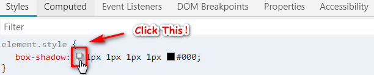
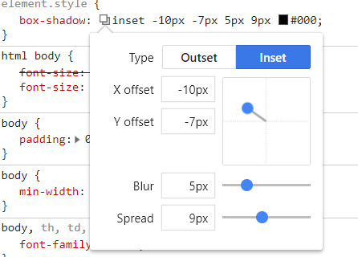

#   A005_简单上手CSS-Shadow #

CSS 的 Shadow属性谁都知道，大家肯定也都用过。

我在学习这个属性的时候 经常记不住它的几个语法参数,随笔记录下我的学习笔记。

> box-shadow: h-shadow v-shadow blur spread color inset;
- h-shadow	必需。水平阴影的位置。允许负值
- v-shadow	必需。垂直阴影的位置。允许负值
- blur	可选。模糊距离
- spread	可选。阴影的尺寸
- color	可选。阴影的颜色。请参阅 CSS 颜色值
- inset	可选。将外部阴影 (outset) 改为内部阴影
 
 后来慢慢记住前5个基本参数后才发现还有内外阴影，叠加阴影的使用。
 
 ```html
<div  style="box-shadow:-10px 0px 10px red,   /*左边阴影*/ 
                        0px -10px 10px #000,  /*上边阴影*/ 
                        10px 0px 10px green,  /*右边阴影*/ 
                        0px 10px 10px blue; /*下边阴影*/ 
                        "></div>
```


以及使用**调试工具**快速调试阴影参数的方法：

想要什么效果，直接拖动蓝色圆点即可，哪怕忘了参数也么得问题！👍





::: tip 参考链接
- [box-shadow制作各种单边,多边阴影 - qiu_freedom - 博客园](https://www.cnblogs.com/qiu-freedom/p/9671033.html)
- [[译|转]深入了解CSS Box Shadow](https://segmentfault.com/a/1190000003952229)
:::