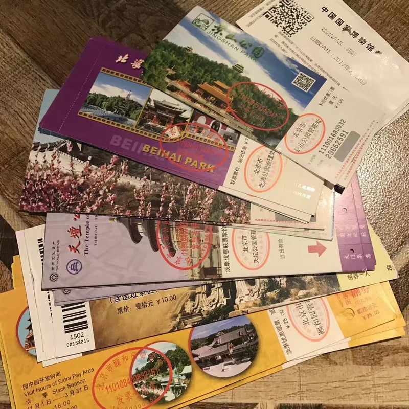

# 北平游记 #
> 2017 . 02/07-02/14 . Peking

**初春**而春未至，**寒冬**依旧。

**北平** 游玩了一周，对于我宅而言着实是一件耗费体力的事。

我这**纤弱**的双腿，不知走过了多少错杂的**胡同**、

多少一般模样的**公厕**、

多少随手即得的**垃圾桶**、

多少或行走或站立着的**安保人员**。

一张**公交卡**，承载了老北平五环间的人情世故；

一串**糖葫芦**，酝酿出老北平百年多的酸甜苦辣；

一曲**护城河**，把老北平遗忘的风霜往事都给冻上。

诚然，**北平**还有许多地儿我没去摸过，有许多吸引我的去处我没涉及过，但就以此次旅程而言，

**北平**不是我想象中的城市，倘若再有一次机遇，我只怕是就把那**长城**再爬上一回就作罢了。

对于我这**南方无赖**而言，**北平** 这一方城池着实于我不适呵。

也或说是，不管是哪儿，都不如**自家的城**里呆着舒服。

**北平**的**烤鸭**、**涮肉**、**王府井**、**弄巷**、**京八件**、**稻香村**......人在**北平**，体验了不少。

本都是**司空见惯**的事物，到了地儿了，却被某种**深不可测**的气氛影响而**啧啧称叹**，

就像是**丢了脑子在旅行**。

**白日**里走过的大路，**黑夜**里也走过。同一个**疲惫的身躯**，同一个**饱满的胃**。

临走了却又有些**不舍**，就像是**昨儿**个还在火车上闲扯一样，一**睁眼**竟已回到了家。

至于**憾事**，终归是要有的，可此时也**记不起**是哪一遭了。

或说，**记不起**就是一大憾事了吧。

人在**北平**而**心**却不知在哪平。

