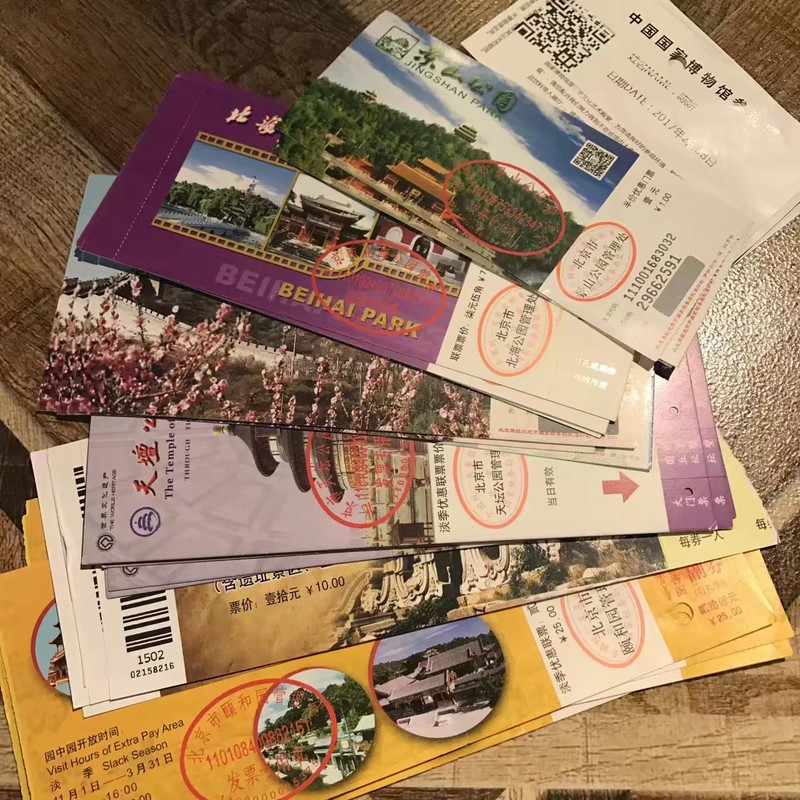

# 寥寥几言回顾2018 #
 **2018** 对我而言是一个蜕变的年，一个暂别梦想向现实低头的年。
因为大多数事情都是并行的，所以会按时间线叙述，但不严格对照时间线。
以下也是蒙太奇流吧，想到啥写啥。

>## **&1.旅游** ##

### **北京** ###
`2/8-2/13`
1. 北京站
2. 天坛
3. 国家博物馆
4. 南锣鼓巷
5. 鼓楼
6. 旅馆周边
7. 奥运村
8. 颐和园
9. 清华大学
10. 北京大学
11. 圆明园
12. 王府井
13. 三里屯
14. 八达岭
15. 景山公园
16. 天安门
17. 北海公园

关于北京的旅游感悟私底下有写过一篇北平游记，以后有时间再上传整理吧。

>## **&2.毕设** ##

### **基于JSP开发的校园二手交易平台** ###
`3月-7月`
- 毕设论文

- 一辩水过

- 文案整理与资料刻录

总结: **`淼`** 。

> ## **&3.前端学习** ##

 `3月底-5月-10月初`
### 3月底 ###
- 习惯Ubuntu系统

- 学习Linux基本命令

- 学习MySQL基本语句

- 学习JAVA基础知识

### 4月份 ###
- 回学校搞毕设

### 5月份-10月份 ###

- 继续学习JAVA基础知识

- 独立完成JAVA阶段项目开发

    - 学生管理系统

        - 登录与密码修改

        - 学生列表CRUD

        - 班级多表联查(未实现，因为懒得做了，请两天假回来加了10+个需求，做毛线啊，做8剩2！)

- 一季度结束

- 学习ORACLE基本语句

- 前端基础知识学习

    - HTML

    - CSS

    - JS

- JSP开发

- 选定模仿课题【ck】

- 更换课题【兰蔻】

- 随学习进度不断完善课题开发

- 在开发中加入主观优化

- 独立完成JSP项目开发

- 商城业务平台

    - 实现商城基本业务流程

    - 实现商城、用户、图片、地址等多表联查

    - 自封装组件10余种

-  商城管理平台

    - 学习并使用LayUI 

    - 表数据的CRUD

    - 超管与普管的设置

    - 路由跳转前登录校验

- 二季度结束

- 学习与使用Vue.js

- 学习mongoDB

- Bootstrap自适应演练

- 初识three.js

- 理解与尝试require.js

- vue+express+mongoDB

- 二季度项目技术迁移

- 初识wechat小程序开发

- 学习与模仿CSS动画

- 三季度结束

- 备战入职面试

>## **&4.入职** ##

`10月 ` 
三家前端面试

1. 初创企业，对前端能力需求高于自身技术栈，且企业文化较弱，交通远

2. 外包企业，需求过硬的基础技能和一定的工作经验，交通远

3. 初创企业，业务需求仍在逐步明确，有较为成熟的后端业务，对前端需求不是很迫切，企业文化和未来发展可以期待，交通近

选择第三家(其实是只有最后一家给了offer :))

推掉哔哩哔哩，百度在线面试

>## **&5.工作** ##

`10月-12月`
- 重新梳理与学习vue生态圈

- 高阶|重要知识点梳理

- 个人demo项目开发并挂载至github-blog: [timeWaster][2]

- 几个课题研究与落地

- 技术选型

- 逐步清晰业务相关

- 当前季度项目开发

- 前后端分离与调试

> ## **&6.游戏** ##

### DNF ###
 `1月-10月`
- 十六有余个角色

[剑神,阿修罗,风法,帕拉丁,百花,剑魔,光枪,暗枪,关羽,女圣职,女弹药,战法,枪剑*4]

- 真实的深渊体验,
- 不充钱之战术性反向亏腾讯,
- 土豪+欧皇的室友们(`狗达除外`)

> ## **&7.小说** ##

`1月-10月`
 - 整理历年素材
   
 - 确立故事大纲
   
 - 确立主题思想
   
 - 确立书名
   
 - 起点更新至十八章

    故事是高中时构思的，主角名还是同桌给的。
高中写的一版和现在这一版做了很大的改动，加入了一些思考吧。
实际写起来，才意识到写作真是门学问，像我这种门外汉想完成一部作品确实须花些功夫。
三天打渔，两天晒网，说的就是我。两天一更到周更到月更，实在是懒得去动笔，也是对故事的不投入吧。
同时对人物的刻画，宏观与微观的描写，余留的遐想空间，剧情的过渡等等都需要去一一掌握。
总结来说，能把这部小说完成就好，不管什么条条框框了。

> ## **&8.生活** ##

- 报名前端培训

- 顺利毕业

- 作为伪球迷和大学室友一起世界杯夜狂欢

- 第一个月工资，还清花呗

- 给家里办理年付宽带

- 安装网络电视盒子

- 第二个月工资，给父母各买一部新手机,都是便宜的，主要选大屏大电量。`【小米max3，华为note10】`

- 京东白条买下Sony wh1000x-mh3

- 年末时手贱买了网易云音乐黑胶年会员
- ...

> ## **&9.展望未来** ##

- 牙齿护理。拔tm的智齿（咬牙切齿.jpg）
- 钢笔字练习。手机玩多了，现在是键盘打不溜，写字如狗爬哎
- 优雅地解决家里老人视频通话问题
- 给亲戚开发一个电商类小程序/网站
- 小说完成第一卷
- 个人工程开发文档
- 学习pyhton与大数据
- 学习一门外语
- 考研or公务员
- 突然想做远行的志愿者
- 恋爱？没想好，随缘吧。
- ...

## END & THANKS & WISH **2019** ##

 [2]: https://mulander-j.github.io/timeWaster/demo/index.html#/